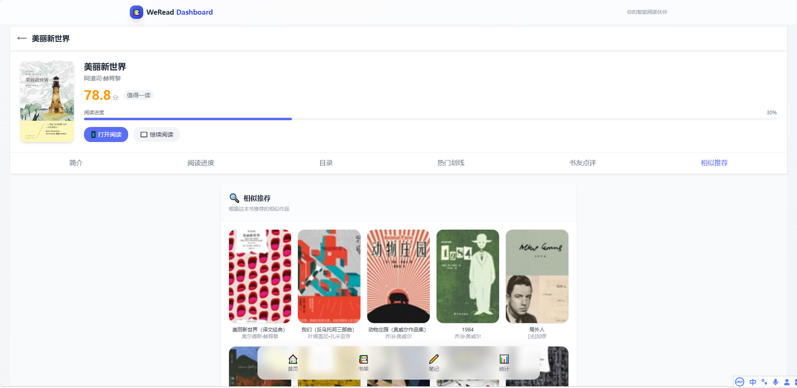

# 📚 WeRead Dashboard

一个优雅的微信读书数据可视化工具，基于 Vue 3 开发，提供书架管理、笔记查看、阅读统计等功能。


## ✨ 功能特性

| 模块 | 功能 |
|------|------|
| 📖 首页 | 阅读概况统计、最近阅读展示 |
| 📚 书架 | 书籍列表、读完/在读筛选 |
| ✏️ 笔记 | 笔记汇总、划线内容、个人想法 |
| 📊 统计 | 阅读天数、时长、偏好分析 |
| 🔍 书籍详情 | 基本信息、阅读进度、章节目录、热门划线、书友点评、相似推荐 |

## 🖼️ 界面预览

| 首页 | 书架 | 笔记 | 统计 |
|------|------|------|------|
|  |  |  |  |


### 书籍详情页



## 🛠️ 技术栈

- **框架**：Vue 3 + Vite
- **路由**：Vue Router 4
- **样式**：Tailwind CSS
- **HTTP**：Axios
- **图标**：Emoji

## 📦 快速开始

### 环境要求

- Node.js 22+
- npm 或 pnpm

### 安装依赖

```bash
npm install
# 或
pnpm install